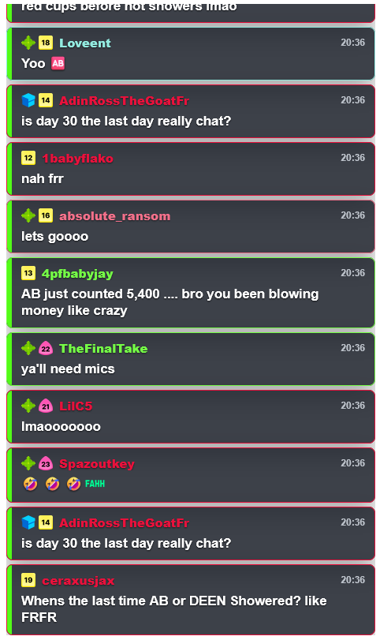

# Chat Box

A multi-chat overlay widget for OBS. Display and manage chat messages from multiple sources in OBS with a customizable interface.

## Features

- **Multi-Chat Support**: Display chat messages from multiple sources
- **Control Panel**: Dedicated control interface for configuration and management
- **Chat Display**: Separate view component for seamless OBS integration

## Architecture

This project consists of two independent Rsbuild applications:

- **Control** (`src/control/`): Settings and control panel for managing the widget
- **View** (`src/view/`): Chat display component optimized for OBS overlay

## Screenshots

### Chat Display



## Getting Started

### Installation

```bash
npm install
```

### Building

Build both control panel and view:
```bash
npm run build
```

Build individual components:
```bash
npm run build:control    # Build control panel
npm run build:view       # Build chat view
```

### Development

Watch mode for automatic rebuilds:
```bash
npm run build:control:watch   # Watch control panel
npm run build:view:watch      # Watch chat view
```

### Linting & Formatting

```bash
npm run check    # Check and fix code with Biome
npm run format   # Format code with Biome
```

### Preview

Preview the built application:
```bash
npm run preview
```

## Configuration

The widget uses the Widy SDK for configuration and storage integration. Configuration is managed through:

- **Manifest**: `manifest.json` defines the widget metadata and permissions
- **Storage**: Widget configuration is persisted using the Widy storage API
- **i18n**: Language settings are managed through `src/i18n/i18n.ts`

For detailed scopes and permissions, see `manifest.json`.


## License

This project is licensed under the AGPL License - see the [LICENSE-AGPL](./LICENSE-AGPL) file for details.

## Contributors

- **ik1s3v** - Author and maintainer

## Support

For issues and feature requests, please visit the [GitHub repository](https://github.com/ik1s3v/chat-box).
